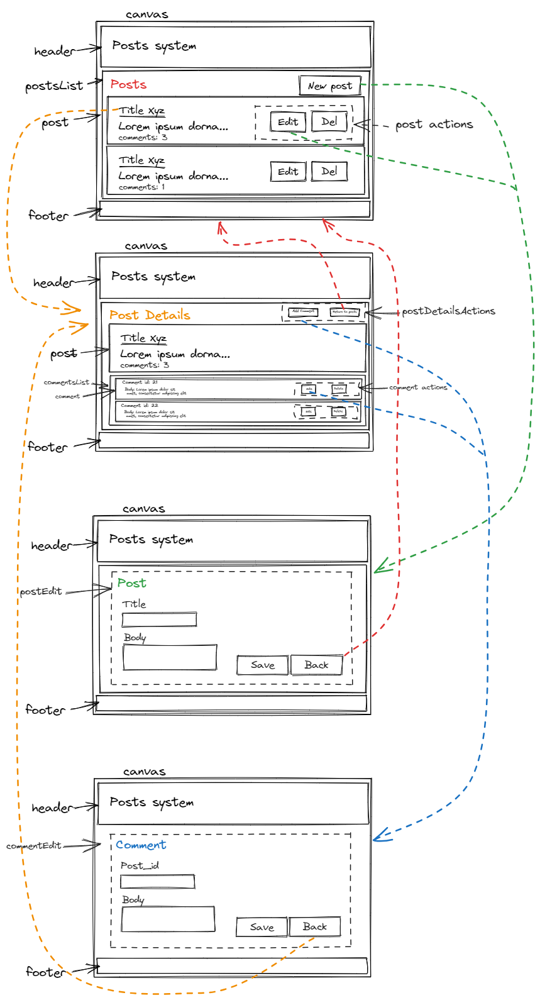

# Level-dev projeto final - TCC

## Descrição

Projeto final do curso Level-Dev da Locaweb sobre desenvolvimento de aplicações web, com foco na conteinerização do processo de desenvolvimento.

A stack utilizada foi:

- Ruby on Rails 7
- Vue 3
- Estilização com Bootstrap 5
- Sqlite3

Trata-se de um sistema de postagens de artigos, onde o usuário pode criar, editar, excluir e visualizar artigos, podendo ainda comentar.

Devido ao curto espaço de tempo, não foi implementado um sistema de autenticação, sendo assim, qualquer usuário pode criar, editar e excluir artigos e comentários.

Com foco didático, o projeto foi dividido em duas partes, uma API (Web) e um cliente (Web), demonstrando as possibilidades de implementação.

### Bonus

Aproveitei o projeto para explorar um pouco mais o conhecimento de uma tecnologia utilizada na squad em que atuo e que gostaria de entender melhor o funcionamento: *Processamento de Background Jobs com Redis e Sidekiq*.

Utilizei essa tecnologia para simular a execução de tarefas complexas/demoradas que seriam executadas em backgroud, liberando as interações com o usuário. A resposta dessas tarefas é disponibilizada em uma página separada (Notifications) para fins de demonstração.

Assim,  utilizando o aprendizado de uso do Doker Compose, adicionei um container para o Redis e outro para uma ferramenta interessante de visualização de filas do **Redis**, o **RedisInsight**.

Ao longo do desenvolvimento, esbarrei com algumas necessidades que possiblitaram ainda mais o aprendizado, como por exemplo, a necessidade de subir o servidor Sidekiq junto com a aplicação, para que as tarefas fossem executadas. Para isso, descobri a gem **foreman**, que possibilita a execução de vários processos em um único terminal.

## Instalação

A instalação é feita através do Docker Compose, que irá criar os containers necessários para a execução da aplicação.

Após clonar o repositório, basta executar o comando:

```bash
docker-compose build
docker-compose run web bash
bundle install
rails db:migrate
yarn install
exit

docker-compose run client bash
yarn install
exit
```

Após a criação dos containers, basta executar o comando:

```bash
docker-compose up
```


A aplicação Rails estará disponível em http://localhost:3000
O client em Vue estará disponível em http://localhost:8080

O monitor de filas do Sidekiq estará disponível em http://localhost:3000/sidekiq

O monitor de filas do Redis (RedisInsight) estará disponível em http://localhost:8001
    - Configurar acesso com:
        - host: redis
        - port: 6379
        - name: tcc-redis-insight

## Rotas - API

- listar posts:
	- http://localhost:3000/posts - 200
- novo post:
	- http://localhost:3000/posts/ (POST + payload) - post with id
- edit post:
	- http://localhost:3000/posts/3 (PUT + payload) - post with id
- destroy post:
	- http://localhost:3000/posts/3 (DELETE) - 204 - none
- show post:
	- http://localhost:3000/posts/2 - post with id
- create comments:
	- http://localhost:3000/posts/1/comments - (POST + payload) - comment detail
- edit comments:
	- http://localhost:3000/posts/1/comments/22 - (PUT + payload) - comment detail
- delete comments:
	- http://localhost:3000/posts/2/comments/78 - (DELETE) - 204 - none
- notifications:
	- http://localhost:3000/notifications - 200
- delete notification:
	- http://localhost:3000/notifications/11 - (DELETE) - 204 - none
- about
	- http://localhost:3000/about - 200


## Utilização

O uso é bem simples, basta criar um usuário e começar a criar artigos e comentários.

### Diagrama do client




